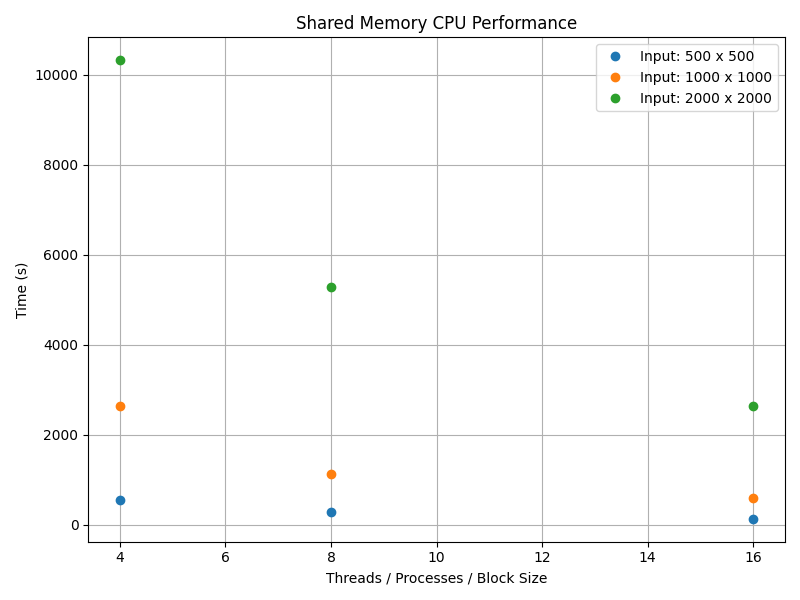

# CS 5030 Final Project
## Team Members - Brandon Herrin and Enoch Shumway

## CHPC Instructions
**Prerequisites for All Run Instructions:** Clone the Git Repository and add the project dataset [`srtm_14_04_6000x6000_short16.raw`](https://usu.instructure.com/courses/778161/files/93555732/download?wrap=1) to the [`tools`](/tools/) subdirectory and rename the file to `6000x6000.raw`.

```bash
# Clone Git Repository
git clone https://github.com/CodyRooBoy/cs5030-final-project.git
cd cs5030-final-project/
```

Each implementation can be run on their own, but the entire scaling study can be run through the `master_run.sh` Bash script.

```bash
# Change the permissions on the Bash script to make it executable
chmod +x ./master_run.sh
# Run the Bash script
./master_run.sh
```

### Resize Tool
The resize tool under [`tools`](/tools/) can be used to take the original 6000 x 6000 image and resize it to smaller datasizes that can be used for quicker runtime if running manually.

```bash
cd tools/
g++ resize_datasets.cpp -o resize

# ./validate <input file name> <input height> <input width> <output file name> <output height> <output width>
./validate 6000x6000.raw 6000 6000 1000x1000.raw 1000 1000
```

### Serial CPU Implementation
The serial CPU implementation is in the [`serial`](/serial/) subdirectory. To compile and run the code on the Kingspeak CHPC cluster, run the `serial_run.sh` Bash script along with the argument for the width and height of the output file.

```bash
cd serial/
# sbatch serial_run.sh <Data Size>
sbatch serial_run.sh 1000
```

The script will schedule a job on the Kingspeak CHPC cluster. The output file will be created in a subdirectory that is named the SLURM Job ID.

To manually run the serial implementation, use the following commands:

```bash
cd serial/

make

# Command Line Format: ./serial.exe $INPUT_FILE_NAME $OUTPUT_FILE_NAME $WIDTH $HEIGHT
./serial.exe 1000x1000.raw output_1000x1000_serial.raw 1000 1000
```

### Parallel Shared Memory CPU Implementation
The parallel shared memory CPU implementation is in the [`shared-cpu`](/shared-cpu/) subdirectory. To compile and run the code on the Kingspeak CHPC cluster, run the `threads_run.sh` Bash script along with the argument for the width and height of the output file.

```bash
cd threads/
# sbatch threads_run.sh <Data Size> <Number of Threads>
sbatch threads_run.sh 1000 8
```

The script will schedule a job on the Kingspeak CHPC cluster. The output file will be created in a subdirectory that is named the SLURM Job ID.

To manually run the serial implementation, use the following commands:

```bash
cd threads/

make

# Command Line Format: ./threaded $INPUT_FILE_NAME $OUTPUT_FILE_NAME $WIDTH $HEIGHT $NUM_THREADS
./threaded 1000x1000.raw output_1000x1000_threaded.raw 1000 1000 8
```

### Parallel CUDA GPU Implementation
The parallel CUDA GPU implementation is in the [`shared-gpu`](/shared-gpu/) subdirectory. To compile and run the code on the CHPC, run the `shared_gpu_run.sh` Bash script along with the argument for the width and height of the output file and the block size for the GPU to use.

```bash
cd shared-gpu/
# sbatch shared_gpu_run.sh <Data Size> <Block Size>
sbatch shared_gpu_run.sh 2000 5
```

The script will schedule a job on the CHPC. The output file will be created in a subdirectory that is named the SLURM Job ID.

To manually run the serial implementation, use the following commands:

```bash
cd shared-gpu/

module load cuda/12.5.0

make

# Command Line Format: ./non_distributed_gpu $INPUT_NAME $OUTPUT_NAME $DATA_SIZE $DATA_SIZE $BLOCK_SIZE
./non_distributed_gpu 1000x1000.raw output_1000x1000_non-dist_GPU_block_size_32.raw 1000 1000 32
```

### Parallel Distributed Memory CPU Implementation
The parallel distributed memory CPU implementation is in the [`distributed-cpu`](/distributed-cpu/) subdirectory. To compile and run the code on the Kingspeak CHPC cluster, run the `distributed_cpu_run.sh` Bash script along with the argument for the width and height of the output file.

```bash
cd distributed-cpu/
# ./distributed_cpu_run.sh <Data Size> <Number of Processes>
sbatch distributed_cpu_run.sh 1000 8
```

The script will schedule a job on the Kingspeak CHPC cluster. The output file will be created in a subdirectory that is named the SLURM Job ID.

To manually run the serial implementation, use the following commands:

```bash
cd distributed-cpu/

module load gcc/8.5.0 intel-mpi

make

# Command Line Format: mpirun -np $NUM_PROCESSES ./distributed_cpu.exe $INPUT_FILE_NAME $OUTPUT_FILE_NAME $WIDTH $HEIGHT
mpirun -np 8 ./distributed_cpu.exe 1000x1000.raw output_1000x1000_mpi.raw 1000 1000
```

### Distributed Memory GPU Implementation
The parallel distributed memory GPU implementation is in the [`distributed-gpu`](/distributed-gpu/) subdirectory. You will need to compile and run the code on the Lonepeak CHPC cluster by running the `distributed_gpu_run.sh` Bash script. You will need to append an argument for the width and height of the output file, the block size used, as well as the number of processes to run.

```bash
cd distributed-gpu/
# sbatch --nodes=<Num Processes> --ntasks=<Num Processes> distributed_gpu_run.sh <Data Size> <Block Size> <Num Processes>
sbatch --nodes=2 --ntasks=2 distributed_gpu_run.sh 1000 32 2
```

The script will schedule a job on the Lonepeak CHPC cluster. The output file will be created in a subdirectory that is named the SLURM Job ID.

### Validation Tool
The validation tool under [`tools`](/tools/) can be used to verify that the output is identical between the serial implementation and the other implementations (the dimensions of the output files have to be the same).

```bash
cd tools/
g++ validate_datasets.cpp -o validate

./validate serial_output.raw other_output.raw 1000 1000
# The tool will respond with a statement either confirming or denying that the files are identical
```

## Our Approach

## **Serial Implementation**

- **How it works:** Bresenham's Algorithm is used to trace a "visibility path" between two points on a terrain.
- **What happens:** As the algorithm moves along the path, it calculates the "altitude" (height) of the path at each step. Then it checks if the terrain at that point blocks the visibility. If the terrain is higher than the visibility line, the visibility is blocked.
- **Outcome:** If there are no blocks along the path, it increments the "visibility count" for the starting point. This happens for each point in the dataset, processed one by one.

---

## **Shared CPU**

- **How it works:** This implementation uses **C++ threads** to parallelize the work. Each thread is assigned a group of points and calculates their visibility independently.
- **What happens:** All threads share the same memory where the terrain's altitude and visibility data are stored. The same visibility calculation code from the serial implementation is used for each thread.
- **Outcome:** Threads work concurrently, speeding up the overall process by splitting the work, but the data is shared and accessed by all threads, meaning synchronization is needed to avoid conflicts.

## **Shared GPU**

- **How it works:** The GPU implementation splits the work across **threads** within **blocks** on the GPU. Each thread is given a single point and calculates its visibility score.
- **What happens:** Inside each block, all threads will check the visibility of a group of points, ensuring the workload aligns across the threads. The threads access shared memory (which is faster but limited in size) to perform calculations.
- **Outcome:** This method leverages the massive parallel processing power of the GPU, where all threads work simultaneously, but access to memory is shared, meaning synchronization is crucial to avoid overwriting data.

## **Distributed CPU**

- **How it works:** This implementation uses **MPI** (Message Passing Interface) to distribute the workload across **multiple processors** (CPUs), each working on a different subset of data.
- **What happens:** The original dataset (the terrain's altitude data) is split across different processes (CPUs). Each CPU works on a subset of points, calculates the visibility for those points, and then at the end, the results are combined into one final output.
- **Outcome:** The workload is distributed across many processors, allowing for greater scalability and faster computation compared to the serial method. This is useful for large datasets that can't fit in a single machine's memory.

## **Distributed GPU**

- **How it works:** Similar to the **Shared GPU** implementation, but now it combines **MPI** with **CUDA** to distribute the workload across multiple GPUs in a distributed system.
- **What happens:** The terrain data is split and sent to different MPI processes (each process controls a GPU). Each GPU then handles a section of the data and calculates visibility for that part.
- **Outcome:** Once the GPUs finish their calculations, the results are sent back to a central process (the "root" process) and combined. This allows for even larger datasets and faster processing by leveraging multiple GPUs across multiple machines.


## Scaling Study
### Serial Execution (CPU)

| Input Size   | Time (s)   |
|--------------|------------|
| 500 x 500    | 2052.03    |
| 1000 x 1000  | 9719.37    |
| 2000 x 2000  | 44245.5    |


---

### Shared Memory CPU

| Input Size   | Thread Count | Time (s)   |
|--------------|--------------|------------|
| 500 x 500    | 4            | 544.182    |
| 500 x 500    | 8            | 277.982    |
| 500 x 500    | 16           | 127.546    |
| 1000 x 1000  | 4            | 2645.26    |
| 1000 x 1000  | 8            | 1127.73    |
| 1000 x 1000  | 16           | 579.894    |
| 2000 x 2000  | 4            | 10319.6    |
| 2000 x 2000  | 8            | 5274.65    |
| 2000 x 2000  | 16           | 2645.26    |



---

### Distributed Memory CPU

| Input Size   | Process Count  | Time (s)   |
|--------------|----------------|------------|
| 500 x 500    | 2              | 760.573    |
| 500 x 500    | 4              | 331.962    |
| 500 x 500    | 8              | 134.784    |
| 1000 x 1000  | 2              | 3313.19    |
| 1000 x 1000  | 4              | 1562.93    |
| 1000 x 1000  | 8              | 679.77     |
| 2000 x 2000  | 4              | -          |
| 2000 x 2000  | 8              | -          |
| 2000 x 2000  | 16             | -          |


---

### Single GPU

| Input Size   | Block Size | Time (s)   |
|--------------|------------|------------|
| 500 x 500    | 5          | 9.6799     |
| 500 x 500    | 15         | 8.45232    |
| 500 x 500    | 32         | 8.16161    |
| 2000 x 2000  | 5          | 166.564    |
| 2000 x 2000  | 15         | 162.665    |
| 2000 x 2000  | 32         | 154.93     |
| 6000 x 6000  | 5          | 1588.69    |
| 6000 x 6000  | 15         | 1557.78    |
| 6000 x 6000  | 32         | 1369.6     |


---

### Distributed Memory GPU

| Input Size   | Process Count  | Time (s)   |
|--------------|----------------|------------|
| 1000x1000    | 2              | 9.9        |
| 1000x1000    | 3              | 6.9        |
| 1000x1000    | 4              | 5.1        |
| 2000x2000    | 2              | 37.0       |
| 2000x2000    | 3              | 25.0       |
| 2000x2000    | 4              | 19.1       |
| 6000x6000    | 2              | 346.9      |
| 6000x6000    | 3              | 231.9      |
| 6000x6000    | 4              | 168.8      |


## Output Visualization
Here is the visualization of the given dataset (using ImageJ, 16-bit signed, little Endian): 

Here is the visualization of the full 6000 x 6000 output image (created by the GPU implementation), (using ImageJ, 32-bit unsigned, little Endian): 

## Task Assignment Breakdown

*Tasks are taken from the Project Tasks assignment submitted earlier in the semester*

| Task                                                                  | Brandon  | Enoch    |
|-----------------------------------------------------------------------|----------|----------|
| Understanding what the output will be                                 | ✔️       |     ✔️   |
| Understanding Bresenham's algorithm                                   |  ✔️      |          |
| Creating the serial implementation                                    | ✔️       |          |
| Creating the parallel shared memory implementation (CPU)              |          | ✔️       |
| Creating the parallel shared memory implementation (GPU)              |          |  ✔️      |
| Creating the distributed memory implementation (CPU)                  |    ✔️    |          |
| Creating the distributed memory implementation (GPU)                  |           | ✔️      |
| Creating the Validation and Resize Tools                              |           |  ✔️     |
| Writing the documentation on running the project |                    | ✔️       |          |
| Completing the scaling studies                                        |     ✔️   |          |
| Writing a report on the approach for the implementations and results (with visualizations of the results) |     ✔️     |     ✔️    |
